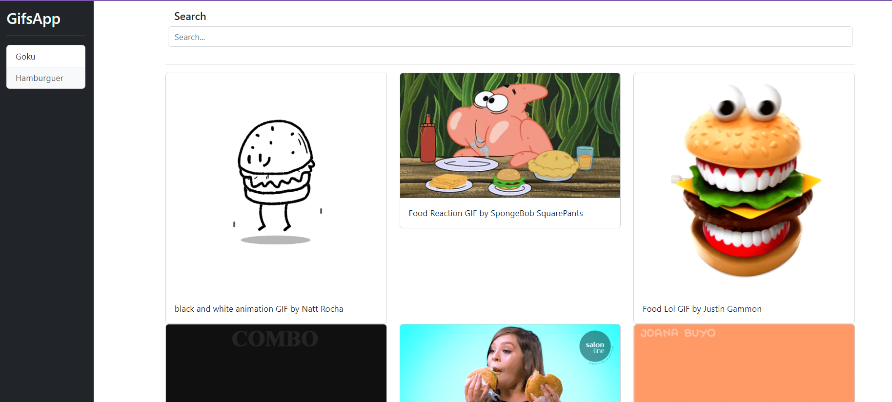

# GifsApp

Funny page to find gifs ! 
Have localStorage to host last 10 gift searched.
Also you can click at the buttons to research it. 

## Development server

Run `ng serve` for a dev server. Navigate to `http://localhost:4200/`. The app will automatically reload if you change any of the source files.

## Application preview

If you clone it, don´t forget to 
npm i

If you clone It, don´t forget:
`npm i`

## Build

Run `ng build` to build the project. The build artifacts will be stored in the `dist/` directory.

## Bootstrap & animate styles 

`https://getbootstrap.com/`
`https://animate.style/`

## Api

`https://developers.giphy.com/`
